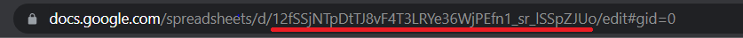

## Brief Description

This project, written in Node.js, utilizes the Google Sheets API to interact with spreadsheets. Data is sourced from a test file named `test-data.js` and written into the spreadsheet. Additionally, the project utilizes the node-cron library to automatically update the spreadsheet data every 2 minutes.

## Configuration

 - To use the Google Sheets API, you need a Google Cloud Platform Project with the API enabled, as well as authorization credentials. **Follow the steps of this [resource](https://stateful.com/blog/google-sheets-api-tutorial)**.
 - After completing the first step, you will receive a credentials file. Create a `.env` file and populate it with environmental variables :
```
# credentials of the service account
GOOGLE_TYPE="data from credentials file"
GOOGLE_PROJECT_ID="data from credentials file"
GOOGLE_PRIVATE_KEY_ID="data from credentials file"
GOOGLE_PRIVATE_KEY="data from credentials file.replace(/\\n/g, '\n')"
GOOGLE_CLIENT_EMAIL="data from credentials file"
GOOGLE_CLIENT_ID="data from credentials file"
GOOGLE_AUTH_URI="data from credentials file"
GOOGLE_TOKEN_URI="data from credentials file"
GOOGLE_AUTH_PROVIDER_X509_CERT_URL="data from credentials file"
GOOGLE_CLIENT_X509_CERT_URL="data from credentials file"
GOOGLE_UNIVERSE_DOMAIN="data from credentials file"

# spreadsheet config
GOOGLE_SPREADSHEET_ID="extract the spreadsheetId from the URL of the spreadsheet"
GOOGLE_SPREADSHEET_RANGE="you can it find at the bottom left of the spreadsheet, for example (Sheet1)"
```


## How to run application

- Download dependencies `npm install`
- Generate `google-api-credentials.json` using `npm run prebuild`
- Run program `npm run dev`

## Addition Resources

[How to securely use Google API service account credentials in a public repo](https://dev.to/wilsonparson/how-to-securely-use-google-apis-service-account-credentials-in-a-public-repo-4k65)